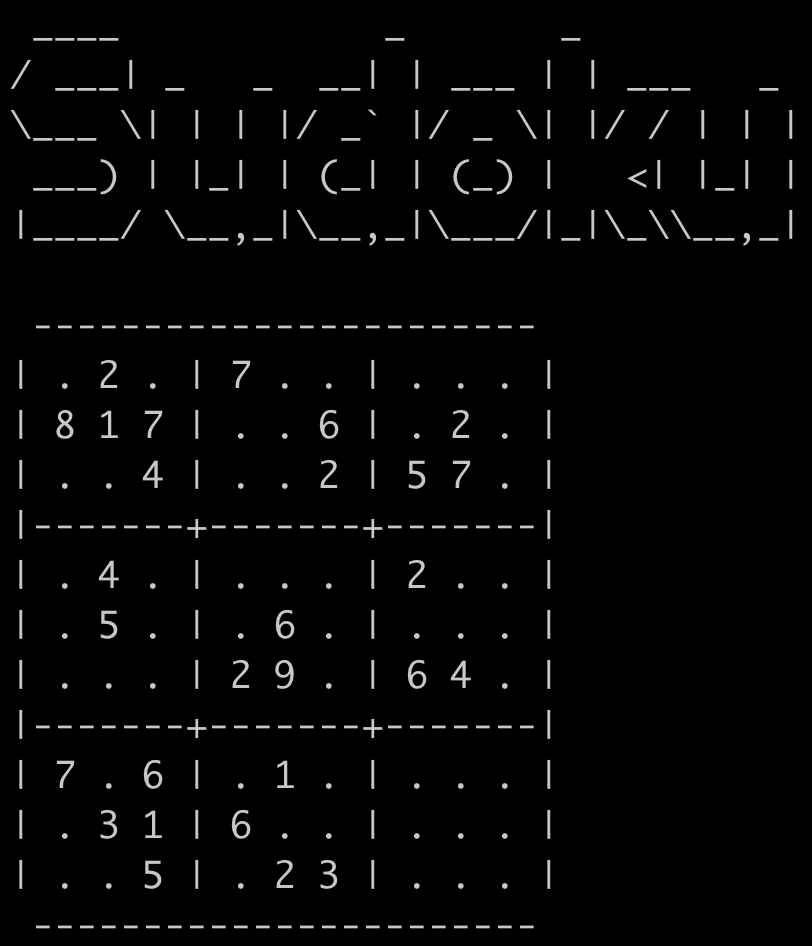

# CLI Sudoku game
This is a sudoku game in the command line application  

# Game modes
## For the player 

To start the game you have to choose the amount of filled cells

In order to insert a number you should type `<row> <column> <value>`, where all values range from 1 to 9

During the game you can use commands:
* `save` - save the game in .pkl file
* `load` - load the game from .pkl file
* `del` - undo
* `exit` - quit the game

## For the computer

To start the game you have to choose the  amount of filled cells

Сomputer will solve the sudoku step by step
